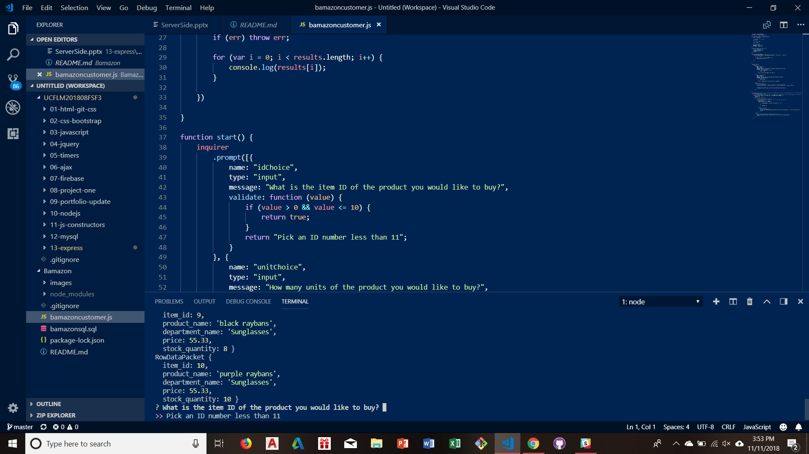
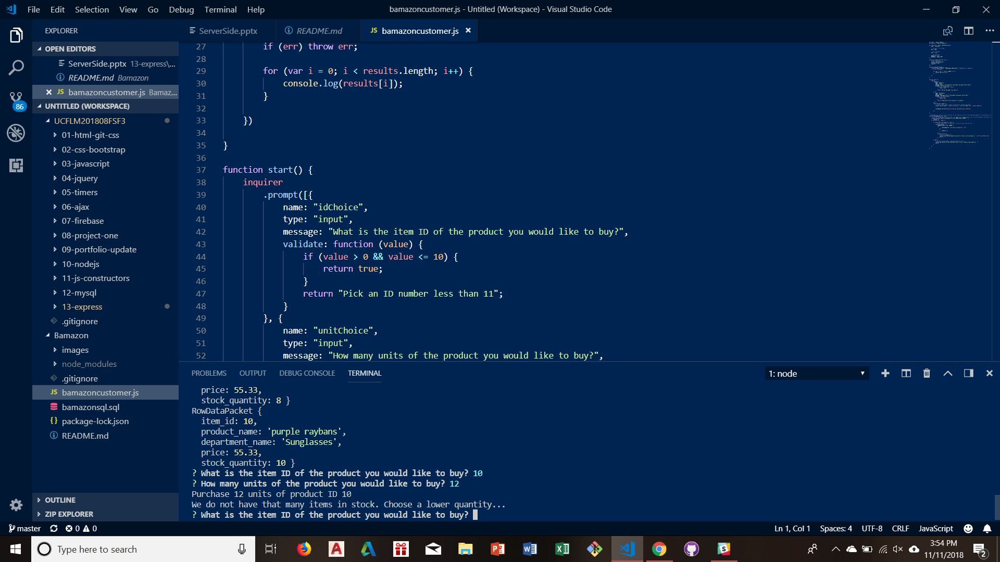

# Bamazon
Bamazon HW
Bamazon is a program that runs in node to give you information on the database of a store that you have created in SQL. Bamazon lets you choose the ID of an item you would like to buy, the quantity you would like to purchase, and lets you know the total of your purchase. If there is not enough of the items in stock that you would like to purchase, Bamazon will let you know that as well. 
 
 See the screenshot below for an example of a successful purchase:

See the screenshot below for an example if an ID outside of what is available is selected. 

See the screenshot below for an example if the user selects a quantity higher than the available stock. 

